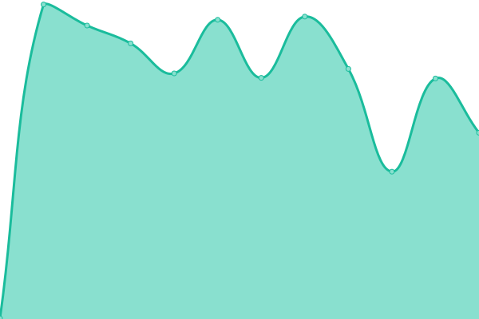
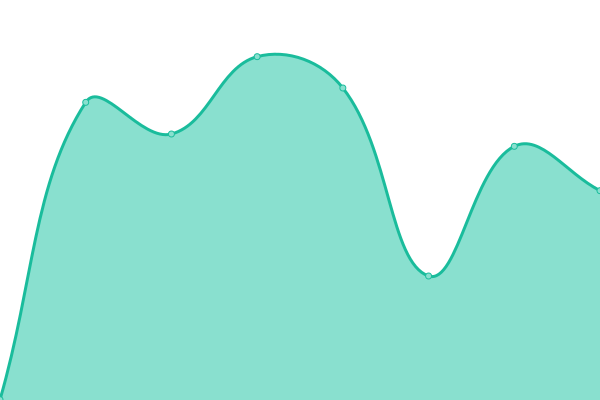
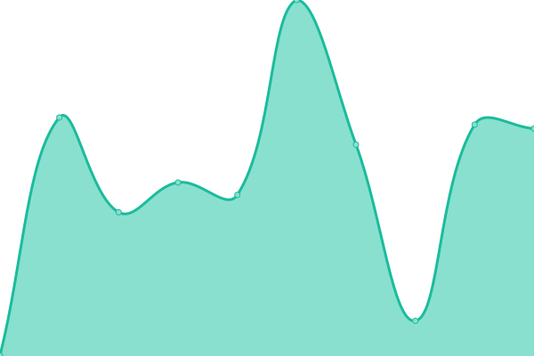

# [📈 Live Status](https://status.dovedale.wiki): <!--live status--> **🟧 Partial outage**

This repository contains the open-source uptime monitor and status page for [iamenews](info.enews.link), powered by [Upptime](https://github.com/upptime/upptime).

With [Upptime](https://upptime.js.org), you can get your own unlimited and free uptime monitor and status page, powered entirely by a GitHub repository. We use [Issues](https://github.com/iamenews/wiki-uptime/issues) as incident reports, [Actions](https://github.com/iamenews/wiki-uptime/actions) as uptime monitors, and [Pages](https://status.dovedale.wiki) for the status page.

<!--start: status pages-->
<!-- This summary is generated by Upptime (https://github.com/upptime/upptime) -->
<!-- Do not edit this manually, your changes will be overwritten -->
<!-- prettier-ignore -->
| URL | Status | History | Response Time | Uptime |
| --- | ------ | ------- | ------------- | ------ |
|  [Wiki Site](https://dovedale.wiki/load.php) | 🟩 Up | [wiki-site.yml](https://github.com/enews/wiki-uptime/commits/HEAD/history/wiki-site.yml) | 

 2128ms
     
 | 

<a href="https://status.dovedale.wiki/history/wiki-site">98.97%</a>
    

|  [Dovedale Assistant Bot](https://kairi.tokyo/) | 🟩 Up | [dovedale-assistant-bot.yml](https://github.com/enews/wiki-uptime/commits/HEAD/history/dovedale-assistant-bot.yml) | 

 356ms
     
 | 

<a href="https://status.dovedale.wiki/history/dovedale-assistant-bot">97.87%</a>
    

|  [Dovedale Translation Panel](https://translation.kairi.tokyo/) | 🟥 Down | [dovedale-translation-panel.yml](https://github.com/enews/wiki-uptime/commits/HEAD/history/dovedale-translation-panel.yml) | 

 549ms
     
 | 

<a href="https://status.dovedale.wiki/history/dovedale-translation-panel">98.44%</a>
    

|  [Dovedale Webhook Proxy](https://webhook.dovedale.wiki/) | 🟩 Up | [dovedale-webhook-proxy.yml](https://github.com/enews/wiki-uptime/commits/HEAD/history/dovedale-webhook-proxy.yml) | 

 499ms
     
 | 

<a href="https://status.dovedale.wiki/history/dovedale-webhook-proxy">99.46%</a>
    

|  [Dovedale Roblox Joiner](https://join.dovedale.wiki/) | 🟩 Up | [dovedale-roblox-joiner.yml](https://github.com/enews/wiki-uptime/commits/HEAD/history/dovedale-roblox-joiner.yml) | 

 468ms
     
 | 

<a href="https://status.dovedale.wiki/history/dovedale-roblox-joiner">99.61%</a>
    

|  [Dovedale Live Map](https://map.dovedale.wiki/) | 🟩 Up | [dovedale-live-map.yml](https://github.com/enews/wiki-uptime/commits/HEAD/history/dovedale-live-map.yml) | 

 412ms
     
 | 

<a href="https://status.dovedale.wiki/history/dovedale-live-map">98.89%</a>
    

<!--end: status pages-->

[**Visit our status website →**](https://status.dovedale.wiki)

## 📄 License

- Powered by: [Upptime](https://github.com/upptime/upptime)
- Code: [MIT](./LICENSE) © [Anand Chowdhary](https://anandchowdhary.com), supported by [Pabio](https://pabio.com)
- Data in the `./history` directory: [Open Database License](https://opendatacommons.org/licenses/odbl/1-0/)
